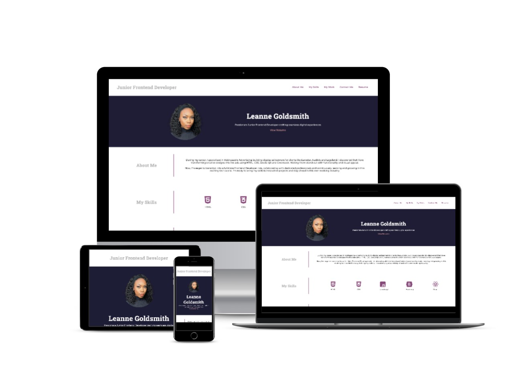

# Junior Frontend Developer Portfolio

## Description

A display of my latest projects and my skillset.

My resume can also be viewed [here](https://leannecodes.github.io/junior-dev-portfolio/assets/Leanne%20Goldsmith%20-%20Frontend%20Developer.pdf).

## Application Appearance

View website [here](https://leannecodes.github.io/junior-dev-portfolio/).

## Credits

- Icons from FontAwesome
- Montserrat and Roboto Slab fonts from Google Fonts
- Oyster and Beyond blog starter code came from JSM Mastery on YouTube
- Budget Planner starter code came from YouTube