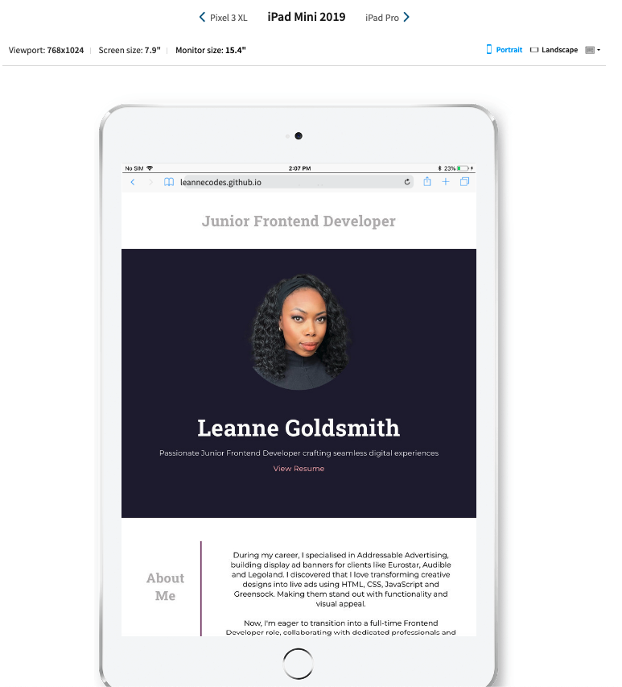

# Junior Frontend Developer Portfolio

## Description

A display of my latest projects and my skillset.

My resume can also be viewed [here](https://leannecodes.github.io/junior-dev-portfolio/assets/Leanne%20Goldsmith%20-%20Frontend%20Developer.pdf).

## Application Appearance

View website [here](https://leannecodes.github.io/junior-dev-portfolio/).

## Bugs

Google Chrome's responsive pixel tool wasn't correctly depicting what my portfolio should look like on different screen sizes. So, to further test my website, I used [Browserstack](https://www.browserstack.com/responsive), to double check if my portfolio displayed as it should across multiple screen sizes, and it did.

Below is a comparison of the Chrome's iPad Mini display of my portfolio, versus the Browserstack iPad Mini display.

| Google Chrome | Browserstack |
|---|---|
| |  |

## Credits

- Icons from FontAwesome
- Montserrat and Roboto Slab fonts from Google Fonts
- Oyster and Beyond blog starter code came from JSM Mastery on YouTube
- Budget Planner starter code came from YouTube